# Vehicle Vitals Solution Storyboards

Last updated: May 20, 2026
Purpose: Convert business and technical requirements into storyboard visuals for beta-test redesign workshops.

## 1) How To Use This Page

1. Start with the Coverage Matrix to confirm requirement coverage.
2. For each storyboard, open both linked visuals (Web and Mobile) on this same page.
3. Use the Discussion Prompts under each storyboard to decide what to rework.
4. Capture decisions against the linked requirement source docs.

---

## 2) Coverage Matrix (Business + Technical)

| Requirement Stream                                 | Primary Source Docs                                         | Storyboards                |
| -------------------------------------------------- | ----------------------------------------------------------- | -------------------------- |
| Personas, market, business outcomes, GTM           | BUSINESS_REQUIREMENTS.md, PROJECT_PLAN.md                   | SB-01, SB-12               |
| Scope and tier delivery status                     | REQUIREMENTS.md, RELEASE_SCOPE_MATRIX.md                    | SB-02, SB-08, SB-12        |
| Product UX flows and IA                            | PRODUCT_DESIGN.md                                           | SB-02 to SB-07             |
| Architecture and platform boundaries               | ARCHITECTURE.md                                             | SB-09                      |
| API contracts and Firestore model expectations     | API_DATA_MODELS.md                                          | SB-03, SB-04, SB-05, SB-09 |
| Security, auth, access control, data protection    | SECURITY_IMPLEMENTATION.md                                  | SB-02, SB-10               |
| Monetization, subscriptions, ads, upgrade triggers | MONETIZATION_STRATEGY.md, PHASE1_IMPLEMENTATION_STATUS.md   | SB-08                      |
| Near-term release gates and execution sequencing   | NEXT_FEATURES_EXECUTION_PLAN.md, R1_COMPLETION_CHECKLIST.md | SB-11, SB-12               |
| Enterprise/org governance and compliance workflows | REQUIREMENTS.md (Enterprise Foundation Update)              | SB-10                      |

---

## 3) Cross-Platform Story Map

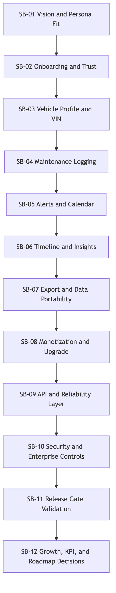

---

## 4) Storyboards

## SB-01 Vision and Persona Fit

Links on this page: [Web Visual](#sb-01-web), [Mobile Visual](#sb-01-mobile)

Business requirement focus:

- Responsible owner confidence and reduced maintenance misses
- Fleet and multi-vehicle visibility
- Young driver clarity and approachable UX

Technical requirement focus:

- Cross-platform parity framing (web + mobile)
- Shared capability definitions before UI divergence

Discussion prompts:

- Which persona is underserved in the first 30 seconds?
- Do web and mobile communicate the same value promise?

### SB-01-Web

### SB-01-Mobile

---

## SB-02 Onboarding, Authentication, and Trust

Links on this page: [Web Visual](#sb-02-web), [Mobile Visual](#sb-02-mobile)

Business requirement focus:

- Fast activation and conversion to first vehicle
- Minimize onboarding drop-off

Technical requirement focus:

- Secure auth, session handling, protected routes
- Policy-aligned sign-up/reset flows

Discussion prompts:

- Where do users hesitate during sign-in/sign-up?
- Which trust signals are missing for first-time users?

### SB-02-Web

### SB-02-Mobile

---

## SB-03 Vehicle Setup and VIN Intelligence

Links on this page: [Web Visual](#sb-03-web), [Mobile Visual](#sb-03-mobile)

Business requirement focus:

- Reduce manual setup effort
- Improve data accuracy for maintenance planning and resale value

Technical requirement focus:

- VIN decoding service contract
- Firestore vehicle schema fidelity and validation

Discussion prompts:

- Which fields should be mandatory vs inferred?
- How should failures in VIN decode degrade gracefully?

### SB-03-Web

### SB-03-Mobile

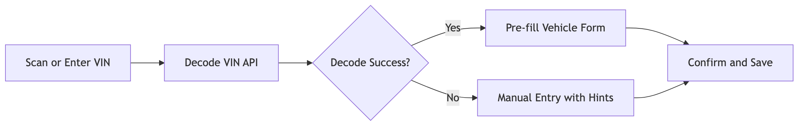

---

## SB-04 Maintenance Logging and Record Integrity

Links on this page: [Web Visual](#sb-04-web), [Mobile Visual](#sb-04-mobile)

Business requirement focus:

- Keep complete history for reliability, warranty, and resale
- Make logging fast enough for routine use

Technical requirement focus:

- Maintenance subcollection structure
- CRUD consistency and validation rules across clients

Discussion prompts:

- Is the logging flow one-screen or multi-step for best completion rate?
- Which fields are required for downstream analytics and reminders?

### SB-04-Web

### SB-04-Mobile

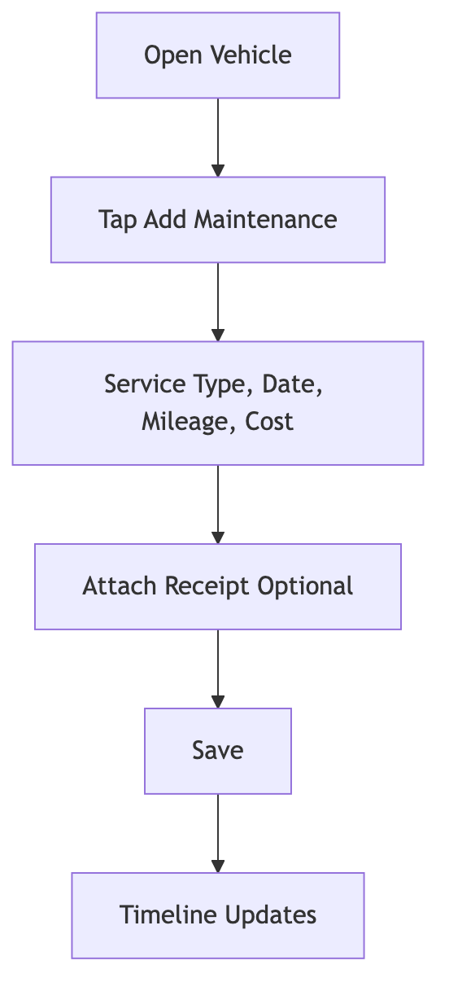

---

## SB-05 Alerts, Upcoming Tasks, and Calendar Actions

Links on this page: [Web Visual](#sb-05-web), [Mobile Visual](#sb-05-mobile)

Business requirement focus:

- Prevent missed maintenance
- Convert reminders into completed service actions

Technical requirement focus:

- Reminder lifecycle actions (snooze, dismiss, complete, reopen)
- Calendar provider flow and callable/HTTP fallback resilience

Discussion prompts:

- Are alert priorities understandable at a glance?
- What should happen when calendar sync fails?

### SB-05-Web

### SB-05-Mobile

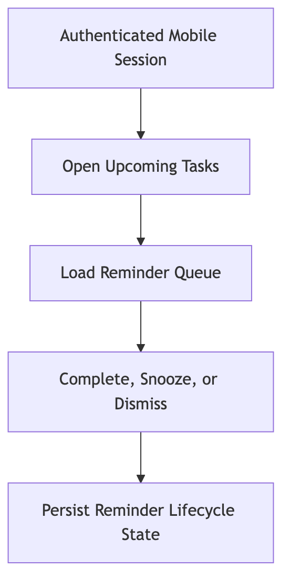

---

## SB-06 Timeline, Dashboard, and Insight Comprehension

Links on this page: [Web Visual](#sb-06-web), [Mobile Visual](#sb-06-mobile)

Business requirement focus:

- Help users answer: what happened, what is next, what will it cost?
- Support multi-vehicle oversight and decision confidence

Technical requirement focus:

- Query/filter consistency
- Performance on high history volumes

Discussion prompts:

- Is trend visibility clear enough for action?
- Which metrics are noise vs must-have?

### SB-06-Web

### SB-06-Mobile

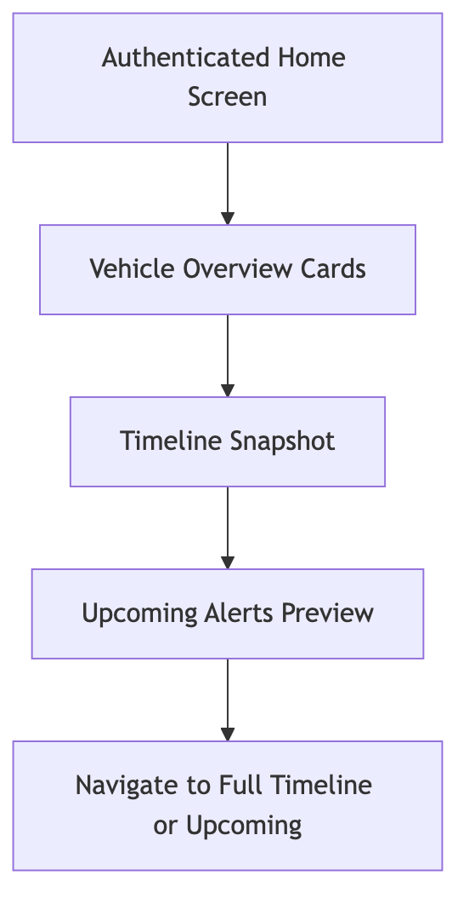

---

## SB-07 Service Providers and Operational Next Step

Links on this page: [Web Visual](#sb-07-web), [Mobile Visual](#sb-07-mobile)

Business requirement focus:

- Convert insight into service action
- Improve repair-shop and dealership discoverability

Technical requirement focus:

- Provider lookup callable contracts
- Preference persistence (radius/type/make matching)

Discussion prompts:

- Is provider confidence explained (distance, relevance, fit)?
- Should provider action start inside app or deep-link out?

### SB-07-Web

### SB-07-Mobile

---

## SB-08 Monetization, Feature Gating, and Upgrade UX

Links on this page: [Web Visual](#sb-08-web), [Mobile Visual](#sb-08-mobile)

Business requirement focus:

- Sustainable revenue via free/pro/premium paths
- Clear value exchange for upgrades

Technical requirement focus:

- Tier entitlement resolution and enforcement
- Ad placement rules and premium ad suppression
- Purchase verification and entitlement sync

Discussion prompts:

- Which upgrade trigger moments feel helpful vs disruptive?
- Do entitlement changes reflect immediately and consistently?

### SB-08-Web

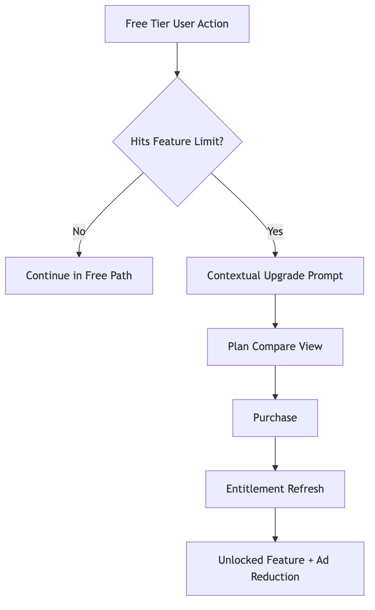

### SB-08-Mobile

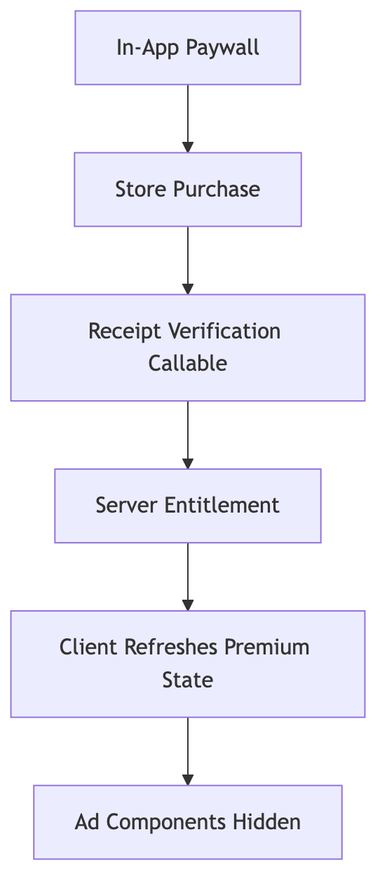

---

## SB-09 Technical Backbone: Data, APIs, and Offline Behavior

Links on this page: [Web Visual](#sb-09-web), [Mobile Visual](#sb-09-mobile)

Business requirement focus:

- Reliability and speed protect retention and trust

Technical requirement focus:

- Firebase-first boundaries (auth, firestore, functions)
- Shared package contracts
- Caching, retries, and offline behavior

Discussion prompts:

- Which errors should block user action vs queue for retry?
- Are API failures visible with actionable guidance?

### SB-09-Web

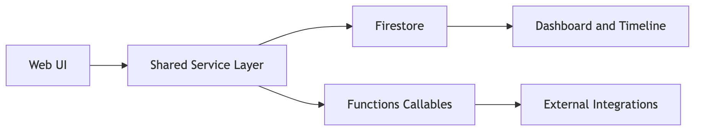

### SB-09-Mobile

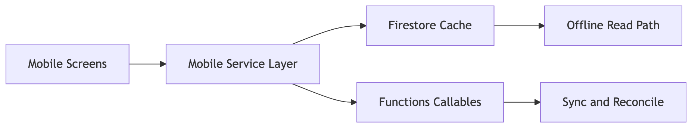

---

## SB-10 Security, Compliance, and Enterprise Controls

Links on this page: [Web Visual](#sb-10-web), [Mobile Visual](#sb-10-mobile)

Business requirement focus:

- Data protection and compliance readiness
- Enterprise support workflows and accountable admin actions

Technical requirement focus:

- Auth enforcement, role checks, rate limiting
- PII handling, retention policy operations, auditability
- Support console and organization membership controls

Discussion prompts:

- Which admin operations need stronger confirmation UX?
- Is the compliance request flow understandable for end users?

### SB-10-Web

### SB-10-Mobile

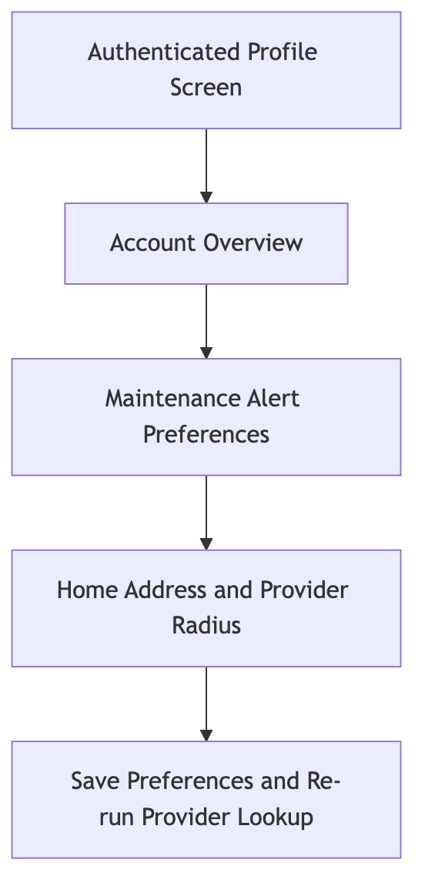

---

## SB-11 Release Confidence Gates (R1) and Beta Evidence

Links on this page: [Web Visual](#sb-11-web), [Mobile Visual](#sb-11-mobile)

Business requirement focus:

- Move from implemented to production-credible
- Provide evidence beta testers can challenge and trust

Technical requirement focus:

- Gate 1 reminder reliability
- Gate 2 mobile runtime parity validation
- Gate 3 export parity signoff

Discussion prompts:

- Which gate evidence is convincing for go/no-go?
- What additional user-observed evidence is needed?

### SB-11-Web

### SB-11-Mobile

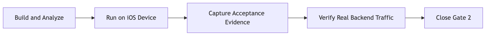

---

## SB-12 Roadmap Rework Workshop Board

Links on this page: [Web Visual](#sb-12-web), [Mobile Visual](#sb-12-mobile)

Business requirement focus:

- Prioritize what increases retention and revenue fastest
- Align roadmap with scope matrix and resource reality

Technical requirement focus:

- Sequence dependencies and risk
- Keep architecture and security constraints explicit in roadmap decisions

Discussion prompts:

- Which rework items are mandatory before scale?
- What can move to later phases without strategic damage?

### SB-12-Web

### SB-12-Mobile

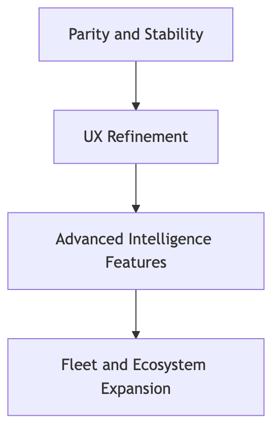

---

## 5) Workshop Scorecard Template

Use this during beta sessions.

| Storyboard | Business Clarity (1-5) | Technical Feasibility (1-5) | Web/Mobile Consistency (1-5) | Rework Priority (H/M/L) | Notes |
| ---------- | ---------------------- | --------------------------- | ---------------------------- | ----------------------- | ----- |
| SB-01      |                        |                             |                              |                         |       |
| SB-02      |                        |                             |                              |                         |       |
| SB-03      |                        |                             |                              |                         |       |
| SB-04      |                        |                             |                              |                         |       |
| SB-05      |                        |                             |                              |                         |       |
| SB-06      |                        |                             |                              |                         |       |
| SB-07      |                        |                             |                              |                         |       |
| SB-08      |                        |                             |                              |                         |       |
| SB-09      |                        |                             |                              |                         |       |
| SB-10      |                        |                             |                              |                         |       |
| SB-11      |                        |                             |                              |                         |       |
| SB-12      |                        |                             |                              |                         |       |

---

## 6) Decision Log Stub

| Date | Storyboard | Decision | Owner | ETA | Validation Method |
| ---- | ---------- | -------- | ----- | --- | ----------------- |
|      |            |          |       |     |                   |
