# Vehicle-Vitals — User Guide

> **Your complete reference for managing vehicle maintenance, tracking costs, and staying ahead of service schedules.**

Last reviewed: July 20, 2026. The web application is live; verify the current
App Store/TestFlight state before representing the iOS build as publicly
available.

---

## Table of Contents

1. [Getting Started](#1-getting-started)
2. [Signing In & Creating an Account](#2-signing-in--creating-an-account)
3. [Your Garage](#3-your-garage)
4. [Adding a Vehicle](#4-adding-a-vehicle)
5. [Editing a Vehicle](#5-editing-a-vehicle)
6. [Vehicle Records](#6-vehicle-records)
7. [Service History](#7-service-history)
8. [Maintenance Plan & Reminders](#8-maintenance-plan--reminders)
9. [Shops & Services](#9-shops--services)
10. [Account & Settings](#10-account--settings)
11. [Frequently Asked Questions](#11-frequently-asked-questions)

---

## 1. Getting Started

Vehicle-Vitals is a secure, cloud-based vehicle management platform. With it you can:

- **Track your entire fleet** — sedans, SUVs, motorcycles, vans, and more — in one place
- **Log and analyze maintenance costs** across all vehicles
- **See your full maintenance timeline** in reverse chronological order
- **Receive proactive reminders** before service is due
- **Store and organize vehicle records** — service histories, repair invoices, ownership docs, and more
- **Find nearby repair shops and dealerships** based on your location and vehicle make

### Supported Platforms

Vehicle-Vitals is live on the web. An iOS client is maintained in this project,
but its current App Store or TestFlight availability must be confirmed through
the active release channel.

### Navigation

The navigation bar at the top of every page provides quick access to all sections:

| Section       | What You'll Find                            |
| ------------- | ------------------------------------------- |
| **Garage**    | Your vehicle list and cost summaries        |
| **Service History** | All maintenance events across every vehicle |
| **Maintenance Plan** | Service recommendations, reminders, and alerts |
| **Shops & Services** | Local repair shops and dealerships |
| **Account** | Profile, subscription, alerts, privacy, and settings |

---

## 2. Signing In & Creating an Account

### Landing Page

When you first visit Vehicle-Vitals, you'll see the landing page with an overview of features.

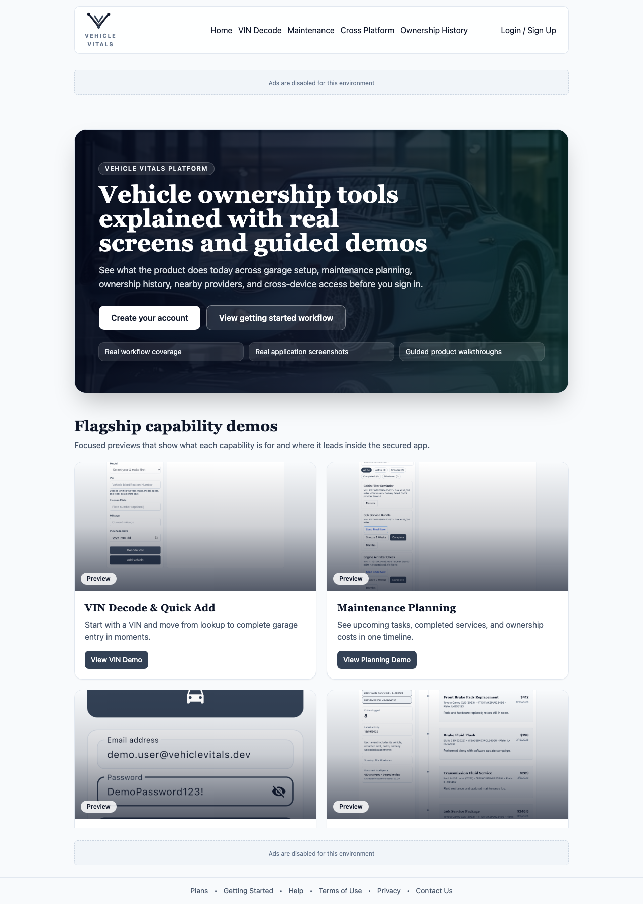

Click **Get Started** or **Sign In** in the header to proceed to the sign-in page.

The landing page now links to two focused preview pages:

- **Getting Started** (`/getting-started`) for onboarding flow highlights and setup steps
- **Product Tour** (`/product-tour`) for the screenshot gallery and video walkthroughs

### Sign In

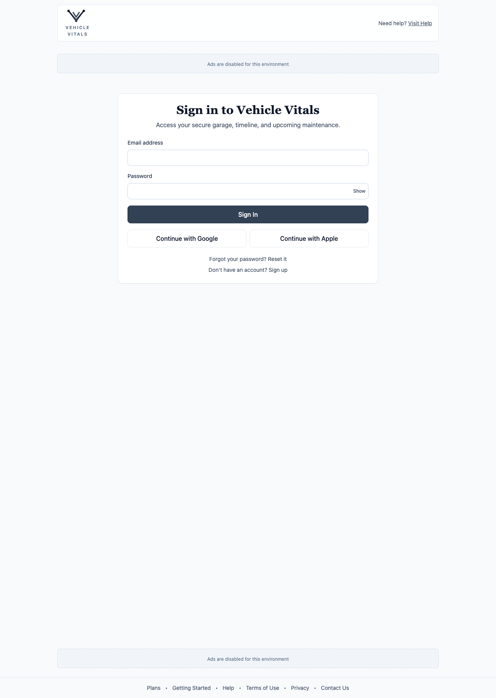

1. Enter your **email address**
2. Enter your **password**
3. Click **Sign In**

You can also sign in with **Google** or **Apple** using the social login buttons.

> **Forgot your password?** Click "Reset it" below the sign-in form. Enter your email and you'll receive a reset link.

### Create an Account

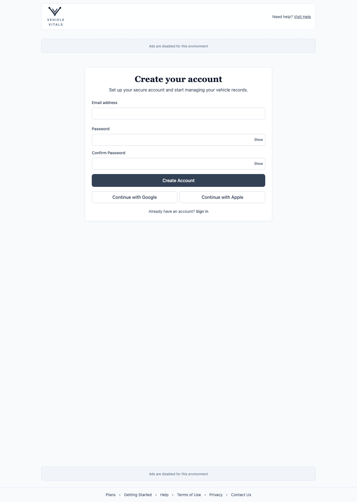

1. Click **Sign up** on the login page
2. Enter your **email address** and choose a **password**
3. Click **Create Account**

Once your account is created, you'll land directly in your Garage.

### iOS Mobile App Views

The following iOS screenshots show the mobile experience for key flows.

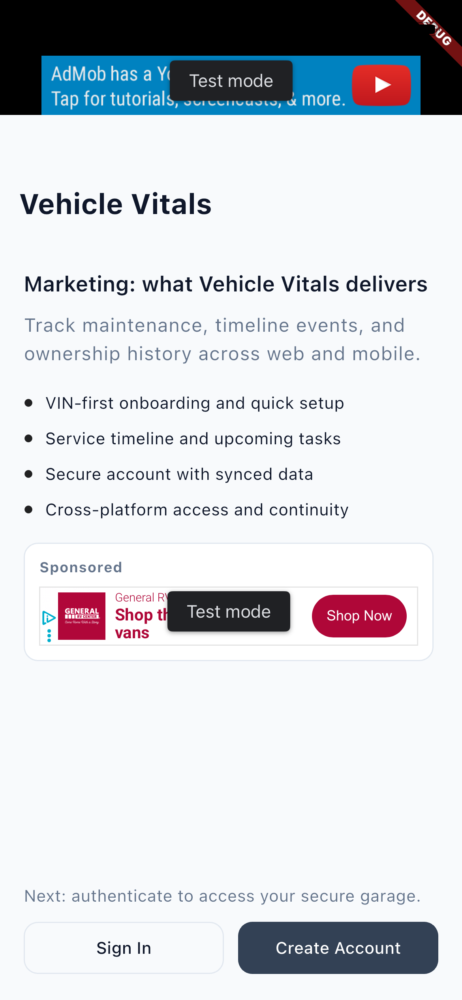

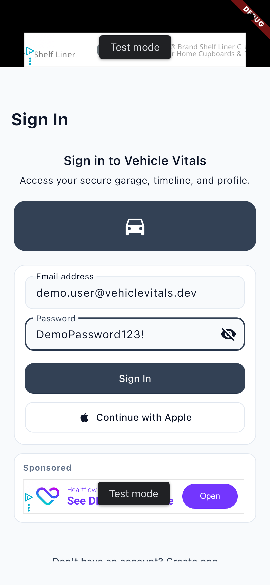

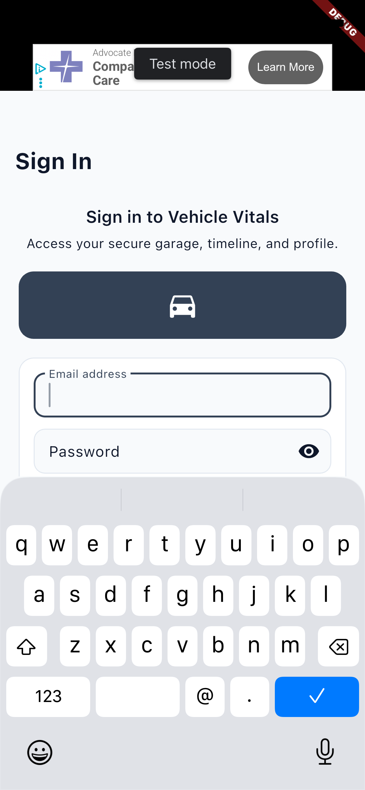

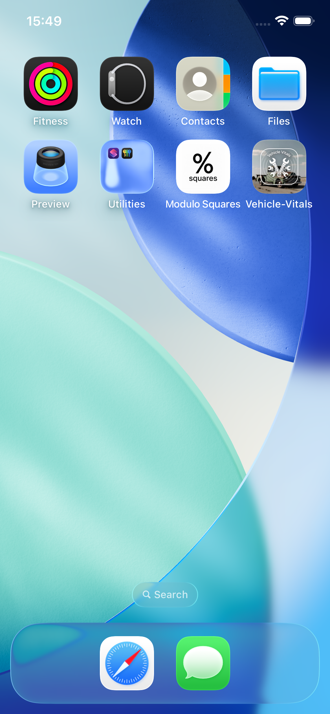

---

## 3. Your Garage

The Garage is your home base — a list of all your vehicles with at-a-glance cost and record status.

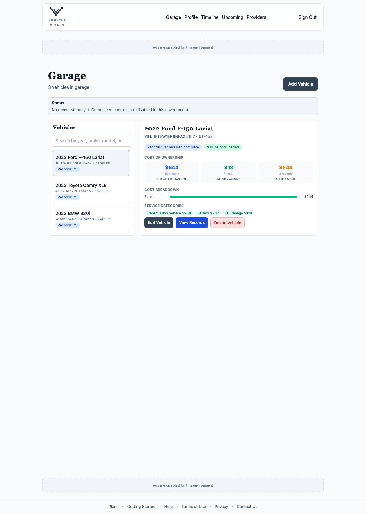

### Vehicle Cards

Each vehicle card displays:

- **Year, Make, Model, and Trim** (e.g., 2022 Ford F-150 Lariat)
- **VIN** and current **odometer** reading
- **Records completion status** (e.g., Records: 7/7)

Click any vehicle card to expand the **detail panel** on the right.

### Vehicle Detail Panel

The detail panel shows:

- **Cost of Ownership** — Total spend, monthly average, and service spend
- **Cost Breakdown** — Category chart (Service, Parts, etc.)
- **Service Categories** — Itemized by type (Oil Change, Battery, Transmission, etc.)
- Action buttons: **Edit Vehicle**, **View Records**, **Delete Vehicle**

### Search

Use the search box above the vehicle list to quickly find a vehicle by year, make, model, or VIN.

### Adding Your First Vehicle

If your garage is empty, click **Add your first vehicle** or the **Add Vehicle** button in the header area.

---

## 4. Adding a Vehicle

Click **Add Vehicle** from the Garage to open the vehicle setup form.

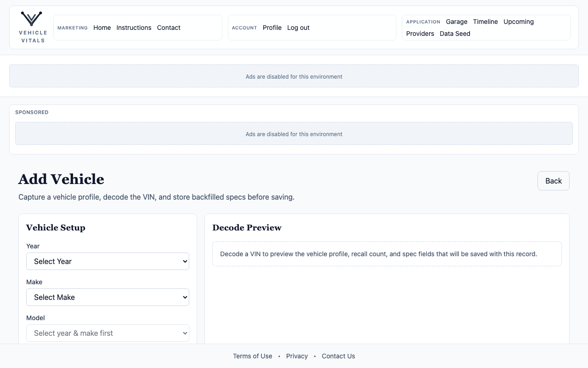

### Vehicle Setup Form

Fill in the following fields:

| Field             | Description                                |
| ----------------- | ------------------------------------------ |
| **Year**          | Model year of the vehicle                  |
| **Make**          | Manufacturer (Ford, Toyota, BMW, etc.)     |
| **Model**         | Specific model and trim                    |
| **VIN**           | 17-character Vehicle Identification Number |
| **License Plate** | State plate number                         |
| **Odometer**      | Current mileage reading                    |

### VIN Lookup

After entering a valid VIN, click **VIN Lookup** to automatically backfill the year, make, and model from NHTSA data. This saves time and ensures accuracy.

### Saving the Vehicle

Once all required fields are complete, click **Save Vehicle**. The vehicle will appear in your Garage immediately.

---

## 5. Editing a Vehicle

From the Garage, select a vehicle and click **Edit Vehicle** in the detail panel.

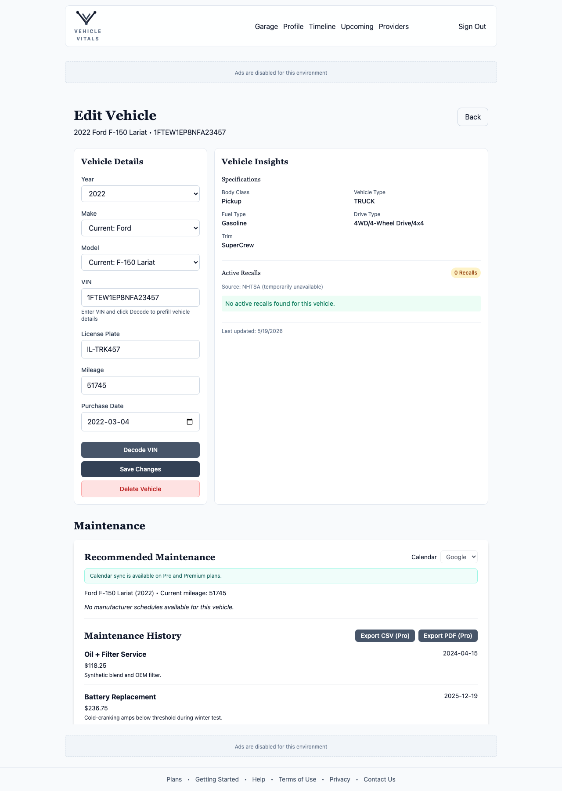

The edit form shows current values pre-filled. You can update:

- **Year, Make, Model, Trim**
- **License Plate**
- **Odometer** (update after service visits)
- **VIN** (rare, but editable)

Click **Save Changes** when done, or **Back** to cancel.

---

## 6. Vehicle Records

Every vehicle has a Records portfolio with 7 required document categories.

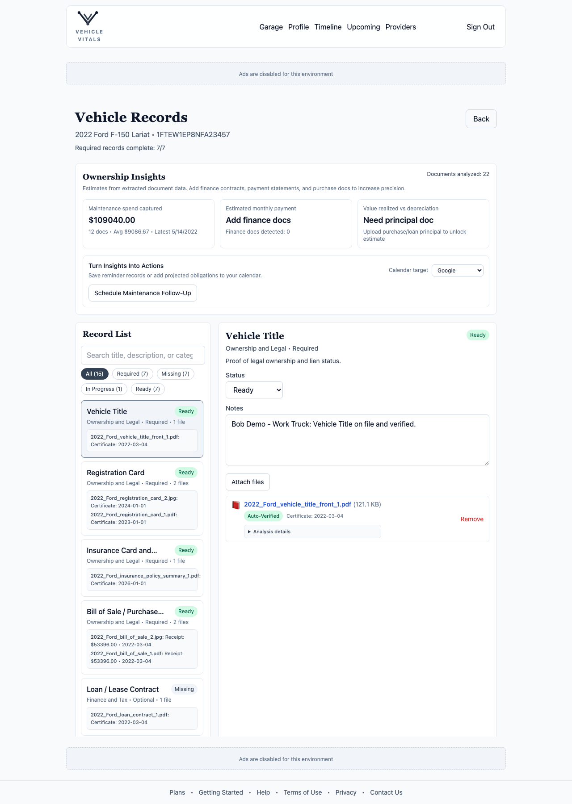

### Accessing Records

From the Garage detail panel, click **View Records**.

### Required Record Types

Vehicle-Vitals tracks **7 required record categories** per vehicle:

| Category            | What to Upload                      |
| ------------------- | ----------------------------------- |
| **Bill of Sale**    | Purchase contract or title transfer |
| **Loan or Lease**   | Financing or lease agreement        |
| **Payment History** | Statements showing payment history  |
| **Service History** | Dealer and shop service records     |
| **Repair Invoices** | Invoices for all repairs and parts  |
| **Insurance**       | Current insurance declarations      |
| **Registration**    | Current registration document       |

A **"7/7 complete"** badge means all required records are filed. Incomplete categories show which documents are still needed.

### Ownership Insights

At the top of the Records page, the **Ownership Insights** panel extracts financial data from your documents:

- **Maintenance spend** — Total dollars tracked, number of docs, latest service date
- **Estimated monthly payment** — Calculated from finance documents
- **Document intelligence** — Shows how many documents have been analyzed

---

## 7. Service History

Service History gives you a bird's-eye view of all service events across your entire garage, in reverse chronological order.

Vehicle-Vitals supports three maintenance user types: self-service owners, mechanic-managed service, and business-maintained fleets. It also supports parts-only receipts, so you can record work even when labor was not billed or no paper invoice exists for the labor portion.

For the full maintenance scenario matrix, see [Maintenance User Cases and Types](./MAINTENANCE_USER_CASES.md).

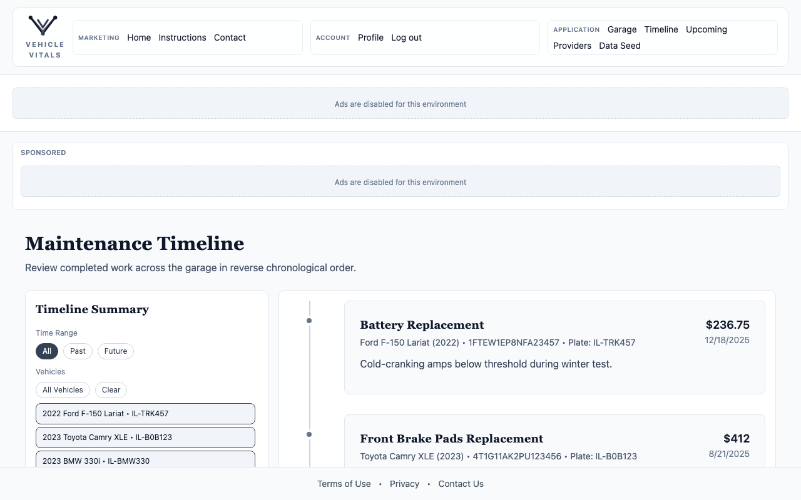

### Service History Summary Panel

The summary at the top shows:

- **Time Range** filter — All, Past, or Future events
- **Vehicle filter** — Show all vehicles or select specific ones
- **Entry count** and **latest activity date**
- **Document intelligence** summary

### Timeline Events

Each event card shows:

- **Service name** (e.g., "Battery Replacement", "Transmission Fluid Service")
- **Vehicle name, VIN, and plate**
- **Cost** and **date**
- **Notes** from the service record

### Filtering the Timeline

Use the **Time Range** buttons to narrow your view:

- **All** — Show every recorded and future event
- **Past** — Only completed service records
- **Future** — Scheduled and upcoming services

Use the **vehicle filter** buttons to focus on one or more specific vehicles.

---

## 8. Maintenance Plan & Reminders

The Maintenance Plan page helps you stay ahead of scheduled maintenance.

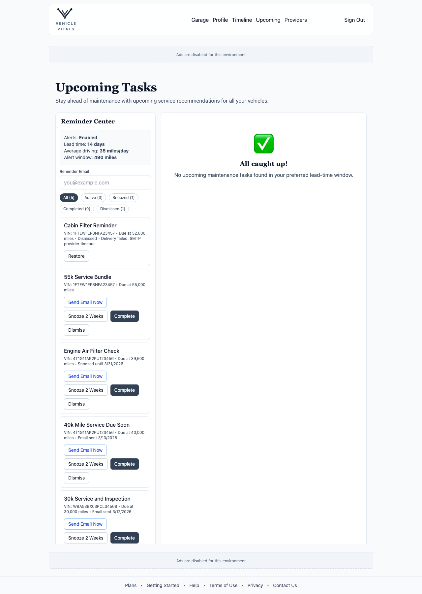

### Reminder Center

The **Reminder Center** panel at the top shows your current alert settings:

- **Alerts** — Enabled or Disabled
- **Lead time** — How many days in advance to alert (default: 14 days)
- **Average driving** — Estimated miles per day (used to predict upcoming mileage)
- **Alert window** — Miles ahead to scan for upcoming service (e.g., 490 miles)
- **Reminder Email** — Address to receive email notifications

### Task Tabs

Filter tasks using the tab bar:

| Tab           | Description                         |
| ------------- | ----------------------------------- |
| **All**       | All reminders regardless of status  |
| **Active**    | Alerts currently due or approaching |
| **Snoozed**   | Alerts deferred to a future date    |
| **Completed** | Reminders you've marked done        |
| **Dismissed** | Alerts you've permanently dismissed |

### Task Actions

For each active reminder, you can:

- **Send Email Now** — Immediately send yourself a reminder email
- **Snooze 2 Weeks** — Defer the reminder for 14 days
- **Complete** — Mark the task as done
- **Dismiss** — Permanently remove the reminder

### Managing Alert Settings

Scroll down on Maintenance Plan to adjust reminder preferences, or go to
**Account → Maintenance Alert Preferences**.

---

## 9. Shops & Services

Find local repair shops and dealerships near your home address.

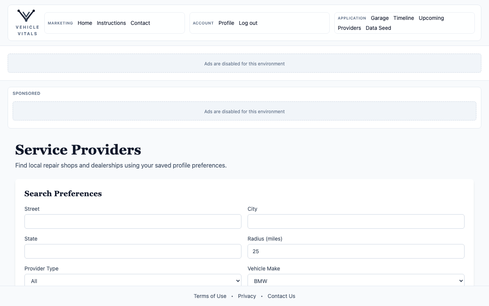

### Search Preferences

Before running a search, configure your preferences:

| Setting                 | Description                                 |
| ----------------------- | ------------------------------------------- |
| **Street, City, State** | Your home or preferred search location      |
| **Radius**              | Search radius in miles (default: 25 miles)  |
| **Provider Type**       | All, Repair shops only, or Dealerships only |
| **Vehicle Make**        | Filter dealerships by your vehicle's make   |

Check **"Prioritize my saved vehicle make"** to rank dealerships matching your vehicles higher in results.

### Running a Search

Click **Find Nearby Providers** to search. Results will appear below, showing provider name, address, phone, and type.

> **Tip:** Save your home address in Account so it pre-fills here automatically.

---

## 10. Account & Settings

Access profile and settings by clicking **Account** in the navigation bar.

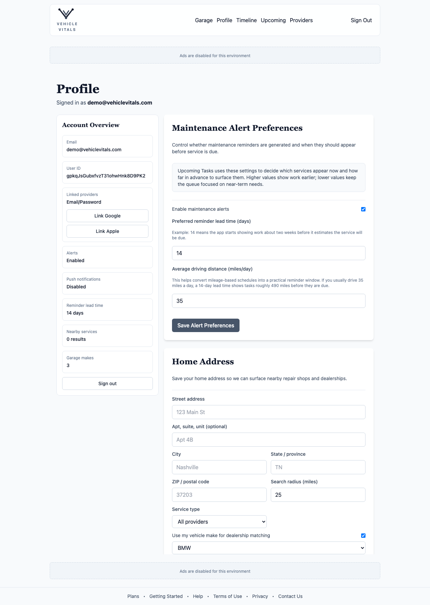

### Account Overview

The top section shows:

- **Email address** on file
- **User ID** (internal reference)
- **Linked providers** — Add Google or Apple login in addition to email/password
- **Alert status**, **push notification status**, and **reminder lead time**

### Maintenance Alert Preferences

Configure when and how you receive maintenance reminders:

- **Enable/Disable** alerts globally
- **Lead time** — Days before service is due to start alerting
- **Average daily miles** — Used to calculate upcoming mileage milestones

Click **Save Alert Preferences** to persist your changes.

### Home Address

Save your address to enable the **Shops & Services** search to pre-populate with your location. It also sets your preferred search radius and provider type filter.

Click **Save Home Address** when done.

### Push Notifications

Click **Enable Push Notifications** to receive reminders when service is due. You can manage notification permissions from your browser on the web or from iOS notification settings on mobile.

### Change Password

Enter your current password and a new password, then confirm it. Click **Update password**.

### Delete Account

Enter your current password to confirm, then click **Delete account**. This permanently removes all your data and cannot be undone.

---

## 11. Frequently Asked Questions

**Q: What is a VIN?**
A: A Vehicle Identification Number (VIN) is a unique 17-character code assigned to every vehicle. It's on your dashboard near the windshield, on your insurance card, or on the driver's door jamb.

**Q: Can I add multiple vehicles?**
A: Yes. There is no limit to the number of vehicles you can add to your Garage.

**Q: What file types can I upload for records?**
A: PDF files are recommended for all record uploads. Each record category can have multiple attachments.

**Q: How does VIN Lookup work?**
A: When you enter a VIN and click "VIN Lookup," Vehicle-Vitals queries the NHTSA (National Highway Traffic Safety Administration) database to retrieve the official make, model, and year.

**Q: How are cost totals calculated?**
A: Costs are extracted from uploaded service invoices and repair records using document intelligence. The more records you upload, the more accurate your cost-of-ownership data becomes.

**Q: Can I share my garage with a family member?**
A: Multi-user sharing is on the product roadmap. Currently, each account is private to the account holder.

**Q: How do I update my mileage?**
A: Edit the vehicle from the Garage detail panel. Update the Odometer field and save. This refreshes mileage-based maintenance predictions.

**Q: Why aren't reminder emails arriving?**
A: Check your spam folder first. If emails still don't arrive, verify your
reminder email address in Maintenance Plan and make sure **Alerts: Enabled** is
showing in the Reminder Center.

---

_For additional help, visit the [Support page](https://vehicle-vitals.com/support)._

_Last reviewed: July 20, 2026_
